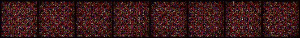

NikuGan
====

DCGANによって美味しそうなお肉画像を生成していきます！

## Description

[onikuimages](http://www.tenandoproject.com/onikuimages/index.html)のサイトからお肉の画像を収集し，DCGANによって学習と画像生成を行なっています．

詳しくは，[Qiita記事](https://qiita.com/mei28/items/6e6c690067c5cdc68d29)をみてください．

## Demo

生成された画像のepochごとの推移です．徐々にお肉が生成されていることが見れると思います．


## Requirement

- torch
- pandas
- numpy
- matplotlib
- PIL
- tqdm 

必要なpackageのバージョンはrequirements.txtにあるので，下のコマンドを実行すると大丈夫です．
```bash
pip install requirements.txt
```

## Usage

- Train.ipynbを実行すると，訓練と画像生成を行います． フォルダのパスなどは適宜変更してください．

## Licence

[MIT](https://github.com/tcnksm/tool/blob/master/LICENCE)

## Author

[mei28](https://github.com/mei28)